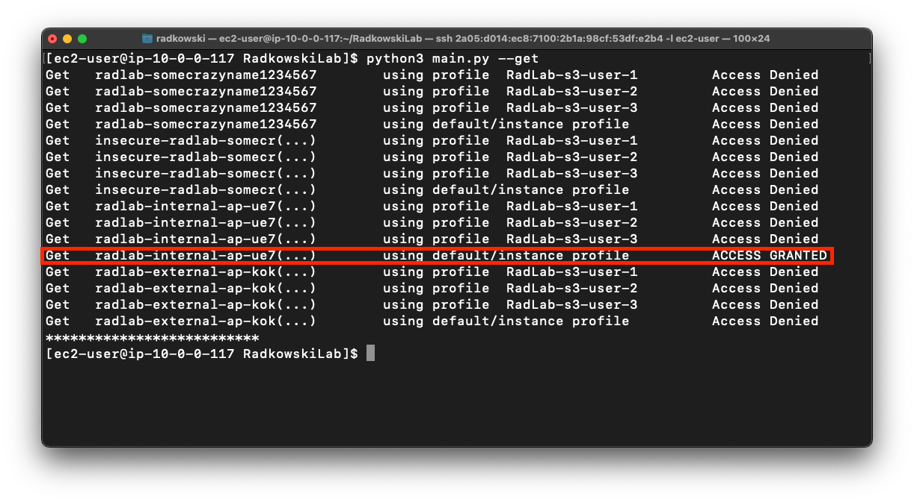

# S3 Access Points

Following solution deploys lab to configure restricted access to S3 bucket using S3 Access Points

## Solution Diagram


## Resources
Following soilution deploys multiple resources, grouped into four main terraform modules:
- [ ] **IAM**: deploys EC2 instance profile, IAM group with AmazonS3FullAccess policy and three IAM users that will be used to test solution. Users will not be created if parameter **CreateUsers** in config file is set to _False_.

- [ ] **NETWORK**: deploys VPC with two public and two private subnets, two NAT gateways, Internet Gateway and custom route tables. VPC is deployed in dual stack scenario - subnets are configured with both IPv4 and IPv6 address.

- [ ] **COMPUTE**: deploys EC2 Launch template and security groups that will be used to deploy EC2 instance inside VPC to test communication via Internal S3 access point.

- [ ] **S3**: deploys S3 bucket, internal and external access point, s3 gateway endpoint and all policies.


## Security Requirements

### External access

- [ ] only selected users **(SA)** listed in config file can interact with S3.
- [ ] SA can only Put and Get objects.
- [ ] SA interact with S3 using external access point alias.


### Internal access (from VPC)

- [ ] only role attached to EC2 **(RA)** as an Instance profile, can interact with S3.
- [ ] RA can only Get objects.
- [ ] RA interact with S3 using internal access point alias.

### Admin access
- [ ] Only admins listed in config file AdminARN can bypass security guardrails.
- [ ] It's recomended to add to Admin list at least two principals:
  - default, used in daily basics to interact with AWS Console
  - custom, used by Terraform to deploy this solution

## Deployment

- [ ] Clone repo.
- [ ] Go to TF directotry (terraform IaC code location).
- [ ] Update config file (config.yaml):
  -  **_DeploymentPrefix_**: prefix to be used to create all resources. It can be used to differentiate between multiple deployments in the same account (to avoid conflicts with resource names).
  -  **_EC2KeyName_**: Key configured in Launch template. 
  -  **_Region_**: Deployment Region.
  -  **_VPCCIDR_**: VPC CIDR.
  -  **_BucketName_**: S3 bucket name (must be globaly unique).
  -  **_AdminARN_**: List of Admin ARNs that will be excluded from security guardrails.
  -  **_CreateUsers_**: Switch that defines if Terraform should create test users (_True_) or not (_False_). If _True_, following users will be created:
        - RadLab-s3-user-1
        - RadLab-s3-user-2
        - RadLab-s3-user-3    
  -  **_ExternalUserAccessList_**: When **Createusers** is set to _False_, list of existing users that will have access to S3 via external Access point.


```yaml
Parameters:

  DeploymentPrefix: "RadLab"

  EC2KeyName: "<EXISTING_KEY_NAME"

  Region: eu-central-1
  VPCCIDR: "10.0.0.0/16"

  BucketName: "somecrazyname1234567"

  AdminARN: 
     - "arn:aws:iam::123456789012:role/aws-reserved/sso.amazonaws.com/eu-west-1/MyAdminRole"
     - "arn:aws:iam::123456789012:role/terraform"

  CreateUsers: True

  ExternalUserAccessList:
    - "arn:aws:iam::123456789012:user/someuser"
    - "arn:aws:iam::123456789012:role/somerole"
```
- [ ] Deploy code using terraform.


- [ ] Record bucket and access point aliases names.


## Policy check

Confirm/check all policies.

### S3 bucket policy

```json
{
    "Version": "2012-10-17",
    "Statement": [
        {
            "Sid": "",
            "Effect": "Allow",
            "Principal": {
                "AWS": "*"
            },
            "Action": "*",
            "Resource": [
                "arn:aws:s3:::<BUCKET_NAME>/*",
                "arn:aws:s3:::<BUCKET_NAME>"
            ],
            "Condition": {
                "StringEquals": {
                    "s3:DataAccessPointAccount": "<ACCOUNT_ID>"
                }
            }
        },
        {
            "Sid": "",
            "Effect": "Deny",
            "Principal": {
                "AWS": "*"
            },
            "Action": "s3:*",
            "Resource": [
                "arn:aws:s3:::<BUCKET_NAME>/*",
                "arn:aws:s3:::<BUCKET_NAME>"
            ],
            "Condition": {
                "StringNotEquals": {
                    "aws:PrincipalArn": [
                        "<ADMIN_ARN_#1>",
                        "<ADMIN_ARN_#2>"
                    ],
                    "s3:DataAccessPointAccount": "<ACCOUNT_ID>"
                }
            }
        }
    ]
}
```


### External Access Point Policy

```json
{
    "Version": "2008-10-17",
    "Statement": [
        {
            "Effect": "Allow",
            "Principal": {
                "AWS": [
                    "arn:aws:iam::<ACCOUNT_ID>:user/RadLab-s3-user-3",
                    "arn:aws:iam::<ACCOUNT_ID>:user/RadLab-s3-user-2",
                    "arn:aws:iam::<ACCOUNT_ID>:user/RadLab-s3-user-1"
                ]
            },
            "Action": [
                "s3:Get*",
                "s3:Put*",
                "s3:List*"
            ],
            "Resource": "arn:aws:s3:<REGION>:<ACCOUNT_ID>:accesspoint/<EXTERNAL_ACCESS_POINT_NAME>/object/*"
        },
        {
            "Effect": "Deny",
            "Principal": {
                "AWS": "*"
            },
            "Action": "s3:*",
            "Resource": [
                "arn:aws:s3:eu-central-1:<ACCOUNT_ID>:accesspoint/<EXTERNAL_ACCESS_POINT_NAME>",
                "arn:aws:s3:eu-central-1:<ACCOUNT_ID>:accesspoint/<EXTERNAL_ACCESS_POINT_NAME>/object/*"
            ],
            "Condition": {
                "StringNotEquals": {
                    "aws:PrincipalArn": [
                        "arn:aws:iam::<ACCOUNT_ID>:user/RadLab-s3-user-1",
                        "arn:aws:iam::<ACCOUNT_ID>:user/RadLab-s3-user-2",
                        "arn:aws:iam::<ACCOUNT_ID>:user/RadLab-s3-user-3"
                    ]
                }
            }
        }
    ]
}
```


### Internal Access Point Policy

```json
{
    "Version": "2008-10-17",
    "Statement": [
        {
            "Sid": "Statement1",
            "Effect": "Allow",
            "Principal": {
                "AWS": "arn:aws:iam::<ACCOUNT_ID>:role/<INSTANCE_PROFILE_ROLE>"
            },
            "Action": [
                "s3:Get*",
                "s3:List*"
            ],
            "Resource": "arn:aws:s3:<REGION>:<ACCOUNT_ID>:accesspoint/<INTERNAL_ACCESS_POINT_NAME>/object/*"
        },
        {
            "Effect": "Deny",
            "Principal": {
                "AWS": "*"
            },
            "Action": "s3:*",
            "Resource": [
                "arn:aws:s3:<REGION>:<ACCOUNT_ID>:accesspoint/<INTERNAL_ACCESS_POINT_NAME>",
                "arn:aws:s3:<REGION>:<ACCOUNT_ID>:accesspoint/<INTERNAL_ACCESS_POINT_NAME>/object/*"
            ],
            "Condition": {
                "StringNotEquals": {
                    "aws:PrincipalArn": "arn:aws:iam::<ACCOUNT_ID>:role/<INSTANCE_PROFILE_ROLE>"
                }
            }
        }
    ]
}
```


### Gateway VPC endpoint Policy

```json
{
	"Version": "2008-10-17",
	"Statement": [
		{
			"Sid": "AllowUseOfS3",
			"Effect": "Allow",
			"Principal": {
				"AWS": "*"
			},
			"Action": [
				"s3:Get*",
				"s3:List*"
			],
			"Resource": "*"
		},
		{
			"Sid": "OnlyIfAccessedViaAccessPoints",
			"Effect": "Deny",
			"Principal": {
				"AWS": "*"
			},
			"Action": "s3:*",
			"Resource": "*",
			"Condition": {
				"StringNotEquals": {
					"aws:PrincipalArn": "arn:aws:iam::<ACCOUNT_ID>:role/<INSTANCE_PROFILE_ROLE>"
				},
				"ArnNotLikeIfExists": {
					"s3:DataAccessPointArn": "arn:aws:s3:<REGION>:<ACCOUNT_ID>:accesspoint/<INTERNAL_ACCESS_POINT_NAME>"
				}
			}
		}
	]
}
```

### Instance Profile Policy

```json
{
    "Statement": [
        {
            "Action": [
                "s3:Get*",
                "s3:List*"
            ],
            "Effect": "Allow",
            "Resource": [
                "arn:aws:s3:<REGION>:<ACCOUNT_ID>:accesspoint/<INTERNAL_ACCESS_POINT_NAME>",
                "arn:aws:s3:<REGION>:<ACCOUNT_ID>:accesspoint/<INTERNAL_ACCESS_POINT_NAME>/object/*"
            ]
        }
    ],
    "Version": "2012-10-17"
}
```


## Tests

### External VM

- [ ] For each test user, create Access key ID and Secret access key. Use _credentials_example_ file as a template.

#### <a id="CredentialsFile"> Credentials file

```yaml
[RadLab-s3-user-1]
aws_access_key_id = <EXAMPLE-CHANGE-ME> 
aws_secret_access_key = <EXAMPLE-CHANGE-ME> 
[RadLab-s3-user-2]
aws_access_key_id = <EXAMPLE-CHANGE-ME> 
aws_secret_access_key = <EXAMPLE-CHANGE-ME> 
[RadLab-s3-user-3]
aws_access_key_id = <EXAMPLE-CHANGE-ME> 
aws_secret_access_key = <EXAMPLE-CHANGE-ME>
```

- [ ] Prepare test machine with linux. This VM should be located outside AWS (for example your laptop, home computer etc). 

- [ ] [Install](https://docs.aws.amazon.com/cli/latest/userguide/getting-started-install.html) AWS CLI.

- [ ] Copy _credentials_example_ file into _./.aws_ directory (create it if needed). rename file to _credentials_.

- [ ] Check if all profiles has been created successfully by executing following command:

```bash
aws sts get-caller-identity --profile RadLab-s3-user-1
aws sts get-caller-identity --profile RadLab-s3-user-2
aws sts get-caller-identity --profile RadLab-s3-user-3
```


- [ ] Clone repo.

- [ ] Go to _tests_ directory, update _config.yaml_ file:
  -  **_Profiles_**: List of p[rofies to be used to test deployment. Must be the same as defined in _credentials_ file
  -  **_IncludeLocalCredentials_**: Switch that defines if tests should include locally configure credentails or not. Set _False_ for testing solution externaly, and _True_ to test it from EC2 instance
  -  **s3_bucket**: name of the tested bucket. You can find it in terraform outputs
  -  **_external_s3_bucket_**: name of the second bucket used for tests as a reference. by default, terraform will create it with the same name as _s3_bucket_ with prefix _insecure_
  -  **_accesspoints_**: list of access point aliases you can get from terrafrom output. 

#### <a id="ConfigFile"> Config file
```yaml
Config:
  Profiles:
   - 'RadLab-s3-user-1' 
   - 'RadLab-s3-user-2'
   - 'RadLab-s3-user-3'
  IncludeLocalCredentials: False
  s3_bucket: "unsecure-<BUCKET_NAME>"
  external_s3_bucket: "insecure-<BUCKET_NAME>"
  accesspoints:
    internal: "<INTERNAL_ACCESS_POINT_ALIAS>"
    external: "<EXTERNAL_ACCESS_POINT_ALIAS>"
```


- [ ] Install python and dependencies.

```bash
sudo apt install python3.8 # Ubuntu style
sudo yum install python3 # RHEL/CentOS style
pip3 install --user -r requirements.txt
```

- [ ] Run test app to check **List** actions. It's expected that direct access to secure bucket will be granted only for connections made via external access points and only for those principals whihc are authorised (user-1 and user-2). For a reference, all users have access to different s3 buckets, based on user and bucket permissions.


- [ ] Run test app to check **Get** actions. As previously, only approved users can interact with secure bucket and only via external access points. 


- [ ] Run test app to check **Put** actions. Results should be the same as preiously (as per requirements definied at the bottom of this documentation).


### Internal EC2

- [ ] Using Launch Template deployed using Terraform, create new EC2 instance.


- [ ] Clone repo, go to tests directory.

- [ ] Update _config.yaml_ file. Previous [config](#ConfigFile) can be used, change **_IncludeLocalCredentials_** parameter from _False_ to _True_.


```yaml
Config:
  Profiles:
   - 'RadLab-s3-user-1' 
   - 'RadLab-s3-user-2'
   - 'RadLab-s3-user-3'
  IncludeLocalCredentials: True
  s3_bucket: "unsecure-<BUCKET_NAME>"
  external_s3_bucket: "insecure-<BUCKET_NAME>"
  accesspoints:
    internal: "<INTERNAL_ACCESS_POINT_ALIAS>"
    external: "<EXTERNAL_ACCESS_POINT_ALIAS>"
```


- [ ] Copy [previously created](#CredentialsFile) credentials file.

- [ ] Check if all three profiles as well as instance profile works as expected.

```bash
aws sts get-caller-identity --profile RadLab-s3-user-1
aws sts get-caller-identity --profile RadLab-s3-user-2
aws sts get-caller-identity --profile RadLab-s3-user-3
aws sts get-caller-identity 
```


- [ ] Run test app to check **List** actions. It's expected that only role attached to Instance Profile will allow interaction with secure S3. All connections to differemnt S3 buckets will be denied.


- [ ] Run test app to check **Get** actions. As previoulsy, only Instance Profile is authorised to interact with secure S3 bucket.


- [ ] Run test app to check **Put** actions. As Instance Profile doesn't allow Put* actions on secure s3 bucket, this is now Denied. As previously any interaction for principals different than attached to Instance Profile are  denied by default.
